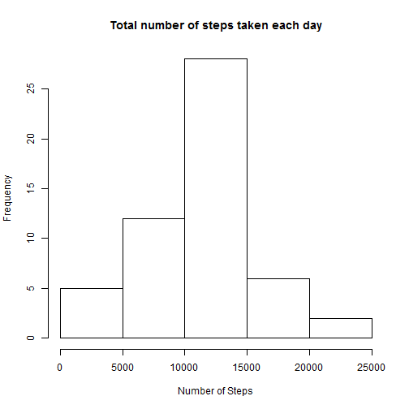
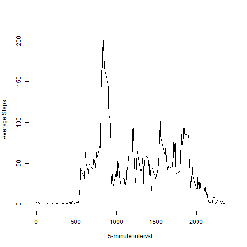
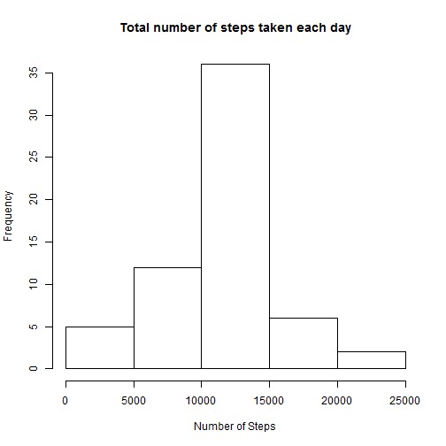
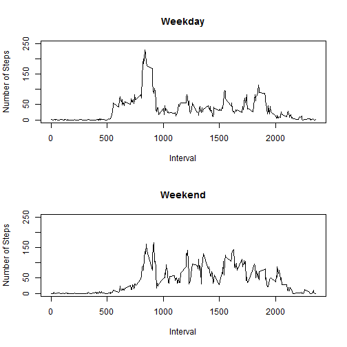

Personal Movement Monitoring
========================================================
This assignment makes use of data from a personal activity monitoring device. This device collects data at 5 minute intervals through out the day. The data consists of two months of data from an anonymous individual collected during the months of October and November, 2012 and include the number of steps taken in 5 minute intervals each day.

Loading the data to the variable original_data

```r
original_data = read.csv('activity.csv', header = TRUE)
```

Removing the rows that contain NA values and load the data to the variable data_no_na

```r
data_no_na = original_data[complete.cases(original_data),]
```

Calculate the total number of steps taken each day
First create a data frame x1 containing two columns (Date, Total Steps)

```r
x1 = aggregate(data_no_na$steps, by = list(data_no_na$date), sum)
colnames(x1) = c('Date', 'Steps')
```

The total number of steps taken each is presented
by the following histogram

```r
hist(x1$Steps, main = 'Total number of steps taken each day', 
     xlab = 'Number of Steps')
```

 

Calculate the mean total number of steps taken per day

```r
mean(x1$Steps)
```

```
## [1] 10766
```

Calculate the median total number of steps taken per day

```r
median(x1$Steps)
```

```
## [1] 10765
```

Making a time series plot of the 5-minute interval and the average numbers of steps taken averaged across all days

```r
data_no_na$interval = as.factor(data_no_na$interval)
x2 = aggregate(data_no_na$steps, by = list(data_no_na$interval), mean)
colnames(x2) = c('Interval', 'Mean_Steps')
plot(as.numeric(as.character(x2$Interval)), x2$Mean_Steps, type = 'l', xlab =
       '5-minute interval', ylab = 'Average Steps')
```

 

Finding the 5-minute interval that contains the maximum number of steps

```r
interval = as.character(x2[which.max(x2$Mean_Steps),1])
interval
```

```
## [1] "835"
```

Inputting Missing Values

Calculating the total number of rows with NAs

```r
numberOfRowsWithNA = nrow(original_data) - nrow(data_no_na)
numberOfRowsWithNA
```

```
## [1] 2304
```

Filling in all of the missing values in the Dataset
To do this i calculated the mean for all the 5-minute intervals

```r
original_data$interval = as.factor(original_data$interval)
x3 = aggregate(original_data$steps, by = list(original_data$interval), FUN = mean, na.rm = TRUE)
colnames(x3) = c('Interval', 'Mean')

temp_interval = 0

for (i in 1:nrow(original_data)) {
  
  if (is.na(original_data[i,1])) {
    
      temp_interval = as.numeric(as.character(original_data[i, 3]))
      
      for (j in 1:nrow(x3)) {
        
        if (as.numeric(as.character(x3[j,1])) == temp_interval) {
          
          original_data[i,1] = floor(x3[j,2])
          break
          
        }
      }
  }
}
```

Making a Histogram of the total number of steps taken each day

```r
x4 = aggregate(original_data$steps, by = list(original_data$date), sum)
colnames(x4) = c('Date', 'Steps')

hist(x4$Steps, main = 'Total number of steps taken each day', 
     xlab = 'Number of Steps')
```

 

Calculating the mean total number of steps taken per day

```r
mean(x4$Steps)
```

```
## [1] 10750
```

Calculating the median total number of steps taken per day

```r
median(x4$Steps)
```

```
## [1] 10641
```
The impact of inputing missing data on the estimates of the total daily number of steps is minor

Creating a factor variable in the dataset with two levels – “weekday” and “weekend” indicating whether a given date is a weekday or weekend day.

Because the result of the function weekdays() is in my language Greek i use a for loop to convert the days in English.


```r
original_data$day = weekdays(as.Date(original_data$date))

for(i in 1:nrow(original_data)) {
  if(original_data[i,4] == 'Δευτέρα')
    original_data[i,4] = 'Monday'
  else if (original_data[i,4] == 'Τρίτη')
    original_data[i,4] = 'Tuesday'
  else if (original_data[i,4] == 'Τετάρτη')
    original_data[i,4] = 'Wednesday'
  else if (original_data[i,4] == 'Πέμπτη')
    original_data[i,4] = 'Thursday'
  else if (original_data[i,4] == 'Παρασκευή')
    original_data[i,4] = 'Friday'
  else if (original_data[i,4] == 'Σάββατο')
    original_data[i,4] = 'Saturday'
  else
    original_data[i,4] = 'Sunday'
}

for(i in 1:nrow(original_data)) {
  if(original_data[i,4] == 'Saturday')
    original_data[i,4] = 'weekend'
  else if (original_data[i,4] == 'Sunday')
    original_data[i,4] = 'weekend'
  else original_data[i,4] = 'weekday'  
}

original_data$day = as.factor(original_data$day)
```

Making a panel plot containing a time series plot of the 5-minute interval (x-axis) and the average number of steps taken, averaged across all weekday days or weekend days (y-axis).

```r
x5 = split(original_data, original_data$day) 
weekdays = x5[[1]]
weekends = x5[[2]]

finalweekdays = aggregate(weekdays$steps, by = list(weekdays$interval), mean)
colnames(finalweekdays) = c('Interval', 'Mean_Steps')
finalweekends = aggregate(weekends$steps, by = list(weekends$interval), mean)
colnames(finalweekends) = c('Interval', 'Mean_Steps')

par(mfrow = c(2,1))
plot(as.numeric(as.character(finalweekdays$Interval)), finalweekdays$Mean_Steps, type = 'l', xlab = 'Interval', 
     ylab = 'Number of Steps', main = 'Weekday', ylim = c(0, 250))
plot(as.numeric(as.character(finalweekends$Interval)), finalweekends$Mean_Steps, type = 'l', xlab = 'Interval', 
     ylab = 'Number of Steps', main = 'Weekend', ylim = c(0, 250))
```

 
